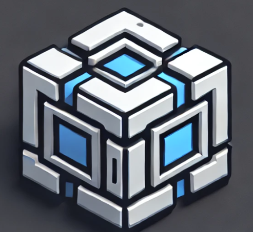
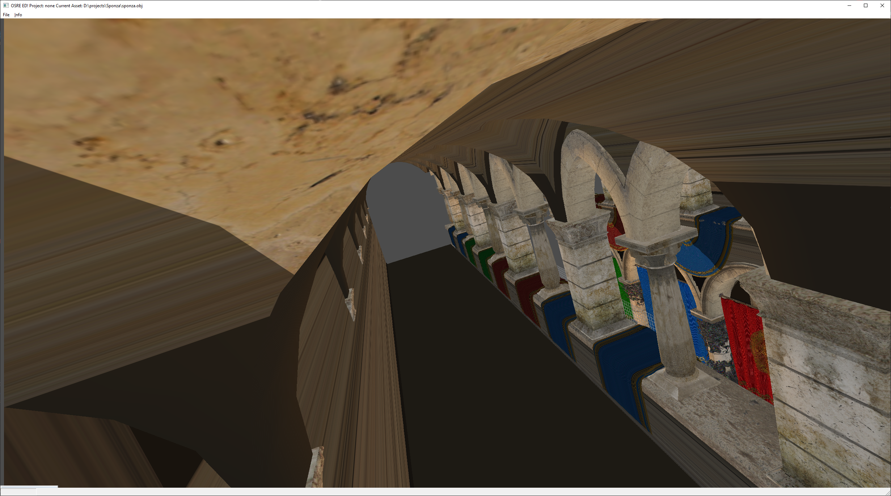

# OSRE - Just another Open Source Render Engine

This is just another open-source render-engine made by Kim Kulling. This is a playground project for myself to work on my own side-projects.

# The Features:
- CMake base build environment
- Multithreaded Renderer 
  - OpenGL
- Platform abstraction to support Windows, Linux and more.
  - Input
  - UI
- Component-based entity system
  - Transformation components
  - Render components
- Event-System
  - Event bus
- More than 40 3D-formats supported thanks to Assimp
- Virtual file-system for reading zip-archives
- Instancing

Discussions: [](https://gitter.im/kimkulling/osre?utm_source=badge&utm_medium=badge&utm_campaign=pr-badge&utm_content=badge)

# Build instructions
- See [Build instruction in the Wiki](https://github.com/kimkulling/osre/wiki/Build)
# Documentation
- Please check [OSRE-Docs](https://osre-doc.readthedocs.io/en/latest/).

# Questions
- Please check our [Reddit-Community](https://www.reddit.com/r/osre/)

# Build Status
[](https://github.com/kimkulling/osre/actions/workflows/cmake.yml)
[](https://scan.coverity.com/projects/kimkulling-osre)
[](https://osre-doc.readthedocs.io/en/latest/?badge=latest)

# Supported compilers
- Windows:
  - Visual Studio 2017
  - Visual Studio 2019
  - Visual Studio 2022
- Linux:
  - GCC
  - Clang

# Quick Start

```cpp
#include <osre/App/App.h>
#include <osre/Common/Logger.h>
#include <osre/RenderBackend/RenderBackendService.h>
#include <osre/Scene/MeshBuilder.h>
#include <osre/Scene/Camera.h>
#include <osre/Platform/AbstractWindow.h>
#include <osre/RenderBackend/glm_common.h>

using namespace ::OSRE;
using namespace ::OSRE::App;
using namespace ::OSRE::RenderBackend;

class QuickStartApp : public AppBase {
    /// The transform block, contains the model-, view- and projection-matrix
    TransformMatrixBlock m_transformMatrix;
    /// The entity to render
    Entity *mEntity;

public:
    /// The class constructor with the incoming arguments from the command line.
    QuickStartApp(int argc, char *argv[]) :
            AppBase(argc, (const char **)argv),
            m_transformMatrix(),
            mEntity(nullptr) {
        // empty
    }

    /// The class destructor, default impl.
    ~QuickStartApp() override = default;

protected:
    /// The creation callback, will get called on system startup.
    bool onCreate() override {
        if (!AppBase::onCreate()) {
            return false;
        }

        // The window
        AppBase::setWindowsTitle("Quickstart! Rotate with wasd, scroll with qe");
        
        // The world to work in
        World *world = getActiveWorld();
        
        // The entity for your triangle
        mEntity = new Entity("entity", *AppBase::getIdContainer(), world);
        
        // The camera to watch the scene
        Scene::Camera *camera = world->addCamera("camera_1");
        ui32 w, h;
        AppBase::getResolution(w, h);        
        camera->setProjectionParameters(60.f, (f32)w, (f32)h, 0.001f, 1000.f);

        // Create and add the triangle 
        Scene::MeshBuilder meshBuilder;
        RenderBackend::Mesh *mesh = meshBuilder.allocTriangles(VertexType::ColorVertex, BufferAccessType::ReadOnly).getMesh();
        if (nullptr != mesh) {
            mEntity->addStaticMesh(mesh);
            world->addEntity(mEntity);            
            
            // And observer the triangle
            camera->observeBoundingBox(mEntity->getAABB());
        }

        return true;
    }

    /// The update, will be called for each render frame
    void onUpdate() override {
        glm::mat4 rot(1.0);
        if (AppBase::isKeyPressed(Platform::KEY_A)) {
            m_transformMatrix.m_model *= glm::rotate(rot, 0.01f, glm::vec3(1, 0, 0));
        }
        if (AppBase::isKeyPressed(Platform::KEY_D)) {
            m_transformMatrix.m_model *= glm::rotate(rot, -0.01f, glm::vec3(1, 0, 0));
        }

        if (AppBase::isKeyPressed(Platform::KEY_W)) {
            m_transformMatrix.m_model *= glm::rotate(rot, 0.01f, glm::vec3(0, 1, 0));
        }

        if (AppBase::isKeyPressed(Platform::KEY_S)) {
            m_transformMatrix.m_model *= glm::rotate(rot, -0.01f, glm::vec3(0, 1, 0));
        }

        if (AppBase::isKeyPressed(Platform::KEY_Q)) {
            m_transformMatrix.m_model *= glm::scale(rot, glm::vec3(1.01f, 1.01, 1.01f));
        }

        if (AppBase::isKeyPressed(Platform::KEY_E)) {
            m_transformMatrix.m_model *= glm::scale(rot, glm::vec3(0.99f, 0.99f, 0.99f));
        }

        // Set the model-matrix in the renderpass
        RenderBackendService *rbSrv = getRenderBackendService();

        rbSrv->beginPass(PipelinePass::getPassNameById(RenderPassId));
        rbSrv->beginRenderBatch("b1");

        rbSrv->setMatrix(MatrixType::Model, m_transformMatrix.m_model);

        rbSrv->endRenderBatch();
        rbSrv->endPass();

        AppBase::onUpdate();
    }
};

OSRE_MAIN(QuickStartdApp)
```

# OSRE-Ed



The engine provdes an 3D-Editor called OSRE-Ed. It is still experimental:

# Get involved
If you want to contribute just use the github project page or reach us via Gitter:
[](https://gitter.im/kimkulling/osre?utm_source=badge&utm_medium=badge&utm_campaign=pr-badge&utm_content=badge)
