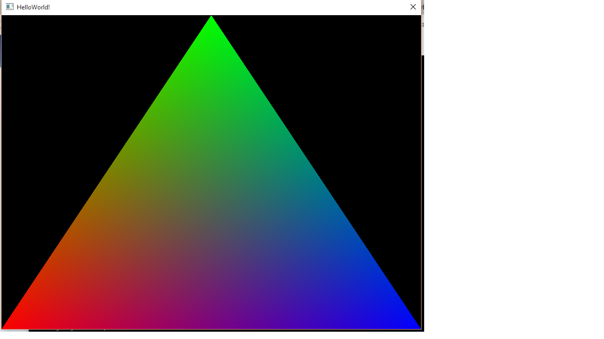

# Hello World

This sample just shows a simple HelloWorld application. The creation of the render window 
and the base setup is included.

## The main application
At first we are including all needed dependecies, use the OSRE namespace and the Renderbackend-namespace. 
The we will generate our simple model-, view- and projection-matrix.

```cpp
#include <osre/App/AppBase.h>
#include <osre/Properties/Settings.h>
#include <osre/Common/Logger.h>
#include <osre/Scene/GeometryBuilder.h>
#include <osre/Scene/Stage.h>
#include <osre/Scene/Node.h>
#include <osre/RenderBackend/RenderCommon.h>

// for the transform ops
#include <glm/glm.hpp>
#include <glm/gtc/matrix_transform.hpp>
#include <glm/gtc/type_ptr.hpp>

using namespace OSRE;
using namespace OSRE::RenderBackend;

// to identify local log entries 
static const String Tag    = "HelloWorld"; 
```

To start OSRE you cann use the base class for main applications. Just rderive from App::AppBase:

```cpp
class HelloWorldApp : public App::AppBase {
    Scene::Stage *m_stage;
    TransformMatrixBlock m_transformMatrix;

public:
    HelloWorldApp( int argc, char *argv[] )
    : AppBase( argc, argv )
    , m_stage( nullptr ) {

    }

    virtual ~HelloWorldApp() {

    }

protected:
    virtual bool onCreate( Properties::Settings *config = nullptr ) {
        AppBase::getConfig()->setString( Properties::Settings::WindowsTitle, "HelloWorld!" );

        if( !AppBase::onCreate( config ) ) {
            return false;
        }

        m_stage = AppBase::createStage( "HelloWorld" );
        Scene::Node *geoNode = m_stage->addNode( "geo", nullptr );
        Scene::GeometryBuilder myBuilder;
        RenderBackend::Geometry *geo = myBuilder.createTriangle();
        if( nullptr != geo ) {
                m_transformMatrix.m_model = glm::rotate(m_transformMatrix.m_model, 0.0f, glm::vec3(1, 1, 0));

                Parameter *parameter = Parameter::create("MVP", PT_Mat4);
                ::memcpy(parameter->m_data.m_data,glm::value_ptr(m_transformMatrix.m_projection*m_transformMatrix.m_view*m_transformMatrix.m_model), sizeof(glm::mat4));

                geo->m_parameter = parameter;
                geo->m_numParameter++;

                geoNode->addGeometry(geo);
        }

        return true;
    }

    virtual void onUpdate()  {
        m_stage->update();
    }
};
```
At first we add a stage as an member attribute of your Hello-World. A stage stores the current scene.
Then we need a transformation to move somthing inside of your scene, so we need another member attribute for the transformation.

Now we create the constructor and the destructor. 

We create the stag in the onCreate callback. When calling AbbBase::create this callback will be called by OSRE. We are creating a simple triangle, 
storing this in a geometry node, add this to the stage. Now we adding the attributes of our vertex layout, creating a parameter to set the transformation 
to a parameter of the geometry.

The onUpdate-callback will be called once per frame. We just updating the stage and thats all.

## The main program
In your main you just need to create the application instance and call create.
Afterwards you enter the main loop, where you can react on events, update your app and request the rendering.
To make this much easier you can just use the macro OSRE_MAIN.
```cpp
OSRE_MAIN( HelloWorldApp )
```

