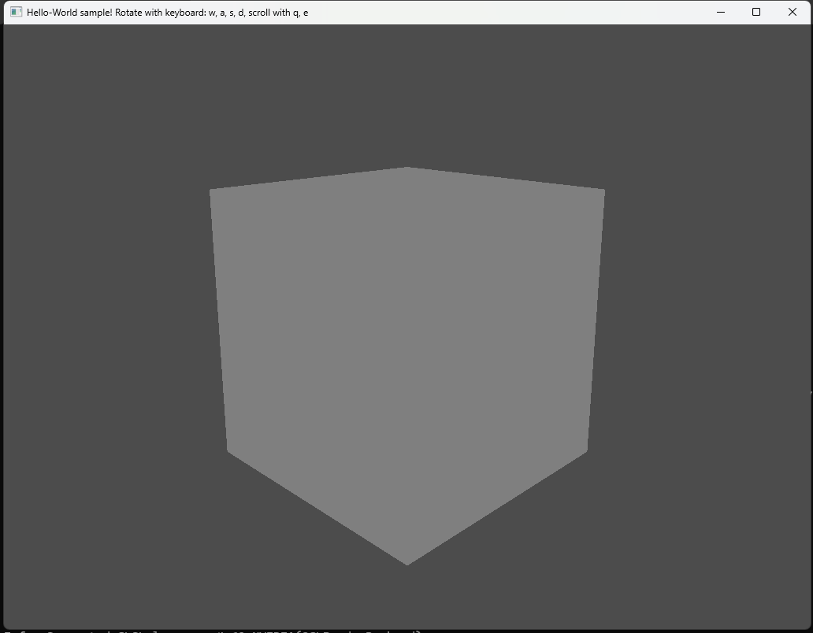

# Hello World

This sample just shows a simple Triangle. The creation of the render window and the base setup is included. 
You can rotate the triangle with your keyboard.

## The main application
At first we are including all needed dependecies, use the OSRE namespace and the Renderbackend-namespace. 
The we will generate our simple model-, view- and projection-matrix.

```cpp
#include <osre/App/AppBase.h>
#include <osre/App/Component.h>
#include <osre/App/Entity.h>
#include <osre/App/World.h>
#include <osre/Common/Logger.h>
#include <osre/RenderBackend/RenderBackendService.h>
#include <osre/Scene/MeshBuilder.h>
#include <osre/Scene/Camera.h>
#include <osre/Platform/AbstractWindow.h>

#include <glm/gtc/matrix_transform.hpp>
#include <glm/gtc/type_ptr.hpp>

using namespace ::OSRE;
using namespace ::OSRE::App;
using namespace ::OSRE::RenderBackend;

// To identify local log entries we will define this tag.
static const c8 *Tag = "HelloWorldApp";

/// The example application, will create the render environment and render a simple triangle onto it
class HelloWorldApp : public App::AppBase {
    /// The transform block, contains the model-, view- and projection-matrix
    TransformMatrixBlock m_transformMatrix;
    /// The entity to render
    Entity *mEntity;

public:
    /// The class constructor with the incoming arguments from the command line.
    HelloWorldApp(int argc, char *argv[]) :
            AppBase(argc, (const char **)argv),
            m_transformMatrix(),
            mEntity(nullptr) {
        // empty
    }

    /// The class destructor.
    ~HelloWorldApp() override {
        // empty
    }

protected:
    bool onCreate() override {
        if (!AppBase::onCreate()) {
            return false;
        }

        AppBase::setWindowsTitle("Hello-World sample! Rotate with wasd, scroll with qe");
        World *world = getActiveWorld();
        mEntity = new Entity("entity", *AppBase::getIdContainer(), world);
        Scene::Camera *camera = world->addCamera("camera_1");
        ui32 w, h;
        AppBase::getResolution(w, h);        
        camera->setProjectionParameters(60.f, (f32)w, (f32)h, 0.001f, 1000.f);

        Scene::MeshBuilder meshBuilder;
        RenderBackend::Mesh *mesh = meshBuilder.allocTriangles(VertexType::ColorVertex, BufferAccessType::ReadOnly).getMesh();
        if (nullptr != mesh) {
            mEntity->addStaticMesh(mesh);
            world->addEntity(mEntity);            
            camera->observeBoundingBox(mEntity->getAABB());
        }

        return true;
    }

    void onUpdate() override {
        glm::mat4 rot(1.0);
        if (AppBase::isKeyPressed(Platform::KEY_A)) {
            m_transformMatrix.m_model *= glm::rotate(rot, 0.01f, glm::vec3(1, 0, 0));
        }
        if (AppBase::isKeyPressed(Platform::KEY_D)) {
            m_transformMatrix.m_model *= glm::rotate(rot, -0.01f, glm::vec3(1, 0, 0));
        }

        if (AppBase::isKeyPressed(Platform::KEY_W)) {
            m_transformMatrix.m_model *= glm::rotate(rot, 0.01f, glm::vec3(0, 1, 0));
        }

        if (AppBase::isKeyPressed(Platform::KEY_S)) {
            m_transformMatrix.m_model *= glm::rotate(rot, -0.01f, glm::vec3(0, 1, 0));
        }

        if (AppBase::isKeyPressed(Platform::KEY_Q)) {
            m_transformMatrix.m_model *= glm::scale(rot, glm::vec3(1.01f, 1.01, 1.01f));
        }

        if (AppBase::isKeyPressed(Platform::KEY_E)) {
            m_transformMatrix.m_model *= glm::scale(rot, glm::vec3(0.99f, 0.99f, 0.99f));
        }

        // Set the model-matrix in the renderpass
        RenderBackendService *rbSrv = getRenderBackendService();

        rbSrv->beginPass(PipelinePass::getPassNameById(RenderPassId));
        rbSrv->beginRenderBatch("b1");

        rbSrv->setMatrix(MatrixType::Model, m_transformMatrix.m_model);

        rbSrv->endRenderBatch();
        rbSrv->endPass();

        AppBase::onUpdate();
    }
};

/// Will generate the main function.
OSRE_MAIN(HelloWorldApp)
```
At first we add a stage as an member attribute of your Hello-World. A stage stores the current scene.
Then we need a transformation to move somthing inside of your scene, so we need another member attribute for the transformation.

Now we create the constructor and the destructor. 

We create the stag in the onCreate callback. When calling AbbBase::create this callback will be called by OSRE. We are creating a simple triangle, 
storing this in a geometry node, add this to the stage. Now we adding the attributes of our vertex layout, creating a parameter to set the transformation 
to a parameter of the geometry.

The onUpdate-callback will be called once per frame. We just updating the stage and thats all.

## The main program
In your main you just need to create the application instance and call create.
Afterwards you enter the main loop, where you can react on events, update your app and request the rendering.
To make this much easier you can just use the macro OSRE_MAIN.
```cpp
OSRE_MAIN( HelloWorldApp )
```

