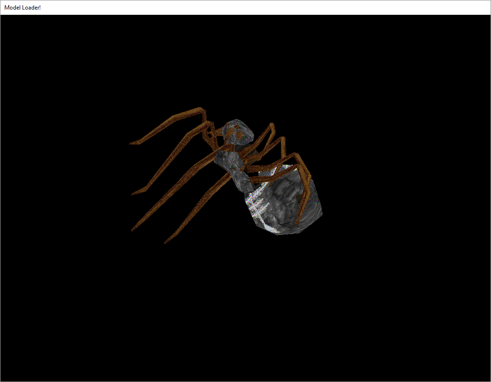

## Mesh Loader

This sample shows how to import a model using Assimp.

```cpp
#include <osre/App/AppBase.h>
#include <osre/App/Entity.h>
#include <osre/Properties/Settings.h>
#include <osre/Scene/Stage.h>
#include <osre/Scene/Node.h>
#include <osre/Scene/View.h>
#include <osre/App/World.h>
#include <osre/App/AssetRegistry.h>
#include <osre/App/AssimpWrapper.h>
#include <osre/App/Component.h>
#include <osre/IO/Uri.h>
#include <osre/Platform/AbstractWindow.h>
#include <osre/RenderBackend/RenderCommon.h>
#include <osre/RenderBackend/RenderBackendService.h>
#include <osre/Scene/GeometryBuilder.h>
#include <osre/Scene/DbgRenderer.h>
#include <osre/Math/BaseMath.h>

using namespace ::OSRE;
using namespace ::OSRE::App;
using namespace ::OSRE::Common;
using namespace ::OSRE::RenderBackend;
using namespace ::OSRE::Scene;

// To identify local log entries 
static const c8 *Tag = "ModelLoadingApp";

// The file to load
static const char *ModelPath = "file://assets/Models/Obj/spider.obj";

static const char *AssetFolderArg = "asset_folder";

static const char* ModelArg = "model";

/// The example application, will create the render environment and render a simple triangle onto it
class ModelLoadingApp : public App::AppBase {
    String m_assetFolder;
    Scene::Stage *m_stage;
    Scene::View  *m_view;
    f32 m_angle;
    glm::mat4 m_model;
    TransformMatrixBlock m_transformMatrix;
    Node::NodePtr m_modelNode;

public:
    ModelLoadingApp( int argc, char *argv[] )
    : AppBase( argc, (const char**) argv, "api:model", "The render API:The model to load")
    , m_assetFolder("")
    , m_stage( nullptr )
    , m_view( nullptr )
    , m_angle( 0.0f )
	, m_model()
    , m_transformMatrix()
    , m_modelNode() {
        // empty
    }

    virtual ~ModelLoadingApp() {
        // empty
    }

protected:
    bool onCreate() override {
        if ( !AppBase::onCreate() ) {
            return false;
        }
        AppBase::setWindowsTitle("ModelLoader sample!");

        const Common::ArgumentParser &parser = AppBase::getArgumentParser();
        if ( parser.hasArgument( AssetFolderArg ) ) {
            m_assetFolder = parser.getArgument( AssetFolderArg );
        }

        IO::Uri modelLoc(ModelPath);
        if (parser.hasArgument(ModelArg)) {
            String modelArg = parser.getArgument(ModelArg);
            String model = "file://assets/" + modelArg;
            modelLoc.setPath(model);
        }

#ifdef OSRE_WINDOWS
        AssetRegistry::registerAssetPath( "assets", "../../media" );
#else
        AssetRegistry::registerAssetPath( "assets", "../media" );
#endif 
        AssimpWrapper assimpWrapper(*getIdContainer());
        if ( assimpWrapper.importAsset( modelLoc, 0 ) ) {
            RenderBackendService *rbSrv( getRenderBackendService() );
            if (nullptr == rbSrv) {
                return false;
            }
                
            Platform::AbstractWindow *rootWindow(getRootWindow());
            if (nullptr == rootWindow) {
                return false;
            }

            m_stage = AppBase::createStage("ModelLoading");
            AppBase::setActiveStage(m_stage);
            Scene::View *view = m_stage->addView("default_view", nullptr);
            AppBase::setActiveView(view);

            const Rect2ui &windowsRect = rootWindow->getWindowsRect();
            view->setProjectionParameters( 60.f, (f32) windowsRect.m_width, (f32) windowsRect.m_height, 0.01f, 1000.f );
            Entity *entity = assimpWrapper.getEntity();
            
            World *world = getActiveWorld();
            world->addEntity( entity );
            view->observeBoundingBox( entity->getAABB() );
            m_modelNode = entity->getNode();
        }

        return true;
    }

    void onUpdate() override {
        
        // Rotate the model
        glm::mat4 rot( 1.0 );
        m_transformMatrix.m_model = glm::rotate( rot, m_angle, glm::vec3( 0, 1, 1 ) );

        m_angle += 0.01f;
        RenderBackendService *rbSrv( getRenderBackendService() );

        rbSrv->beginPass(PipelinePass::getPassNameById(RenderPassId));
        rbSrv->beginRenderBatch("b1");

        rbSrv->setMatrix( MatrixType::Model, m_transformMatrix.m_model);

        rbSrv->endRenderBatch();
        rbSrv->endPass();

        Scene::DbgRenderer::getInstance()->renderDbgText(-1, -1, 2U, "XXX");

        AppBase::onUpdate();
    }
};

OSRE_MAIN( ModelLoadingApp )
```
At first we are generating our render window as usual. In the onCreate-Method we will generate the 
assimp-wrapper and import a model with it.

In the onUpdate-callback the model will be rotated.
