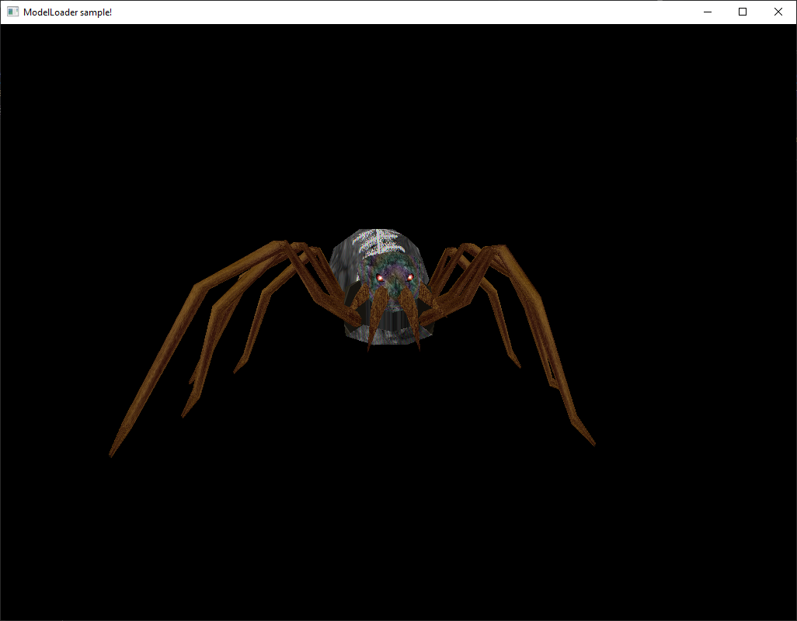

## Widgets

This sample shows how to create UI widgets using the widget system.

```cpp
#include "App/App.h"
#include "RenderBackend/RenderCommon.h"
#include "RenderBackend/TransformMatrixBlock.h"
#include "RenderBackend/RenderBackendService.h"
#include "RenderBackend/RenderPass.h"
#include "RenderBackend/2D/CanvasRenderer.h"
#include "Common/osre_common.h"
#include "Common/Logger.h"
#include "Properties/Settings.h"
#include "UI/WidgetBase.h"
#include "UI/UiService.h"
#include "UI/Button.h"
#include "UI/Panel.h"

using namespace OSRE;
using namespace OSRE::App;
using namespace OSRE::RenderBackend;
using namespace OSRE::Common;

static Ui::WidgetBase *createUi() {
    Rect2i r1(10, 10, 200, 100);
    Ui::Panel *panel = Ui::UiService::getInstance()->createPanel("root", r1, nullptr);
    Rect2i r2(20, 20, 160, 40);
    panel->addWidget(new Ui::Button("Quit", r2, panel));
    return panel;
}

DECL_OSRE_LOG_MODULE(Widgets)

class WidgetsApp final : public AppBase {
public:
    TransformMatrixBlock  mTransformMatrix;
    CanvasRenderer *mCanvasRenderer = nullptr;
    Ui::WidgetBase *mRoot = nullptr;

    WidgetsApp(int argc, char *argv[]) : AppBase(argc, const_cast<const char **>(argv)) {
    }

    ~WidgetsApp() override = default;

protected:
    bool onCreate() override {
        Properties::Settings *baseSettings  = AppBase::getSettings();
        if (baseSettings == nullptr) {
            return false;
        }

        baseSettings->setString(Properties::Settings::WindowsTitle, "Demo in 2D!");
        if (!AppBase::onCreate()) {
            return false;
        }

        mCanvasRenderer = AppBase::getCanvasRenderer();
        mRoot = createUi();
        
        return true;
    }

    void onUpdate() override {
        auto *rbService = ServiceProvider::getService<RenderBackendService>(ServiceType::RenderService);
        mRoot->render(mCanvasRenderer);

        rbService->beginPass(RenderPass::getPassNameById(UiPassId));
        rbService->beginRenderBatch("2d.b1");
        rbService->setMatrix(MatrixType::Model, mTransformMatrix.mModel);
        mCanvasRenderer->render(rbService);
        rbService->endRenderBatch();
        rbService->endPass();

        AppBase::onUpdate();
    }
};

int main( int argc, char *argv[] )  {
    WidgetsApp myApp( argc, argv );
    if ( !myApp.create() ) {
        return 1;
    }
    while (myApp.handleEvents()) {
        myApp.update();
        myApp.requestNextFrame();
    }
    myApp.destroy();

    return 0;
}
```

## Key Concepts
The widget system provides UI elements like panels and buttons. Widgets are created via the UiService and rendered using the CanvasRenderer. Each widget has a position and size defined by a Rect2i.
